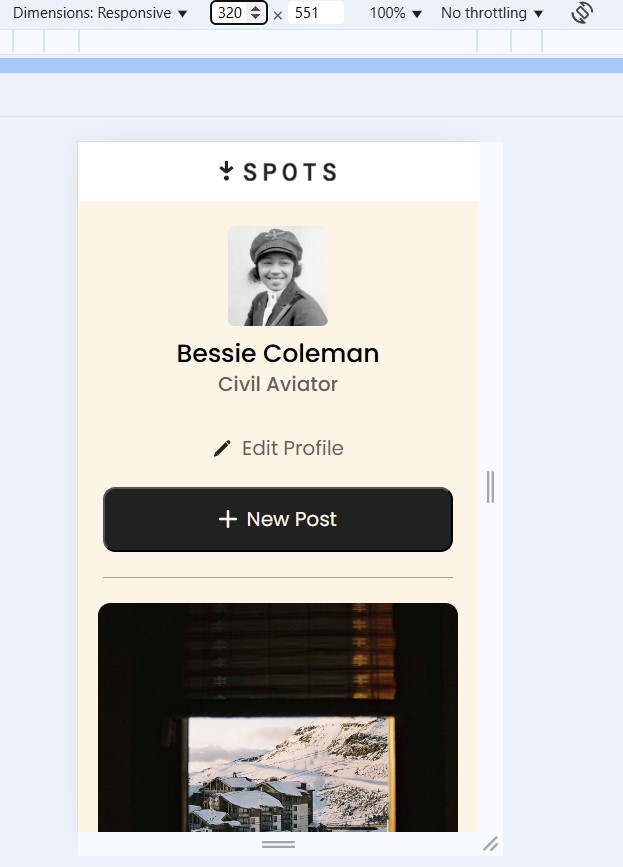
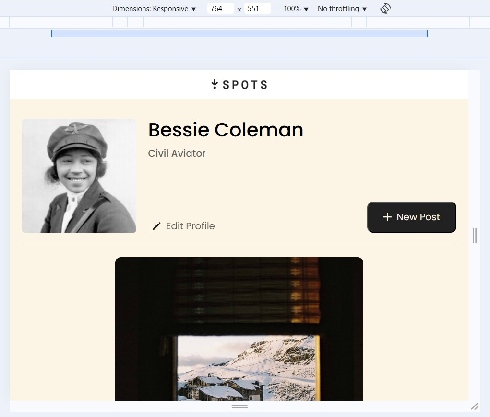
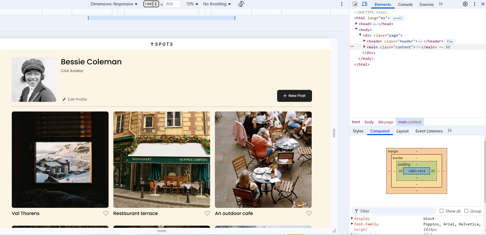

# TripleTen Project 3: Spots

### Overview

- Description
- Techne
- Project Images
- Link to Project via GitHub
- Link to Video Explaining Project

**Description**

This is the third project of the Software Engineering program at TripleTen. It was created using HTML and CSS -- based on the project description and design on Figma -- and features webpage layout technologies and techniques (techne), such as grid layout and media queries, making it responsive to popular screen sizes.

**Techne**

- HTML5
- CSS3
- Flat BEM file structure
- BEM naming conventions
- Semantic tags
- Responsive formats: 320px - 1440px
- Grid layout
- Flexbox
- CSS hover effect
- Incorporation of Fonts.css
- Addition of fonts directory in vendor directory
- Font-face

**Project Images**
images/avatar.jpg
images/1-photo-by-moritz-feldmann-from-pexels.jpg

**Link to Project via GitHub**

https://github.com/MarcPickel/se_project_spots

**Link to Video Explaining Project**
